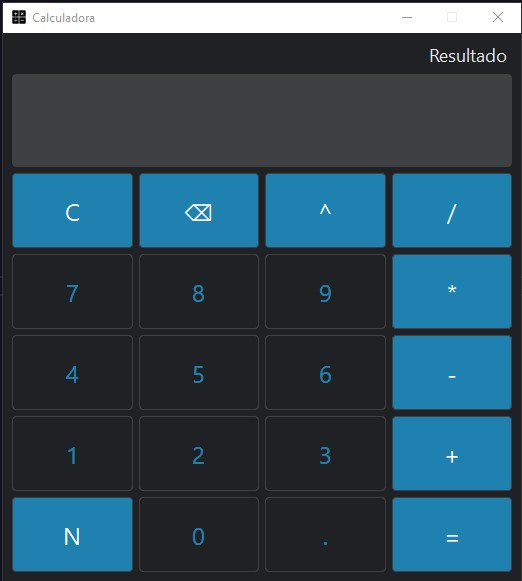

# Calculadora

## Descrição
Projeto de uma calculadora utilizando a biblioteca PySide6 de Python. 

### Funções
* Adição ( + )
* Subtração ( - )
* Potenciação ( ^ )
* Divisão ( / )
* Multiplicação ( * )
* Inverter o sinal ( N )
* Limpar display ( C )
* Apagar ( ⌫ )

## Ferramentas utilizadas
* Python
